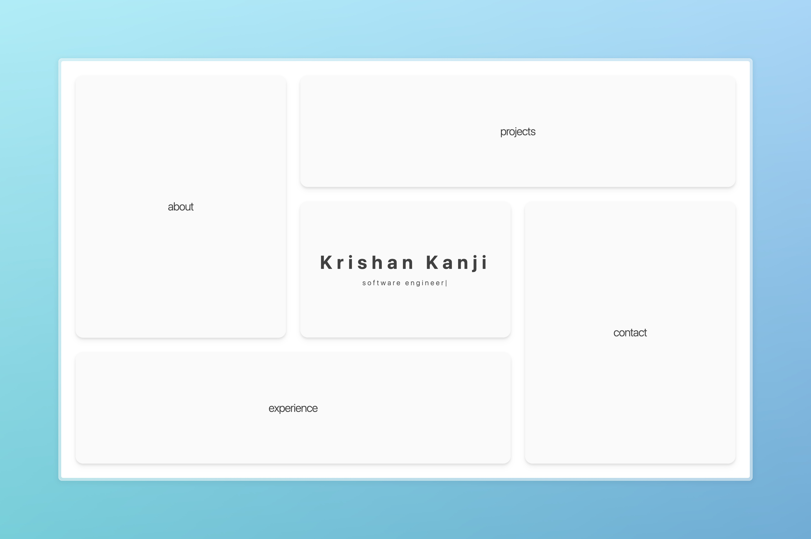
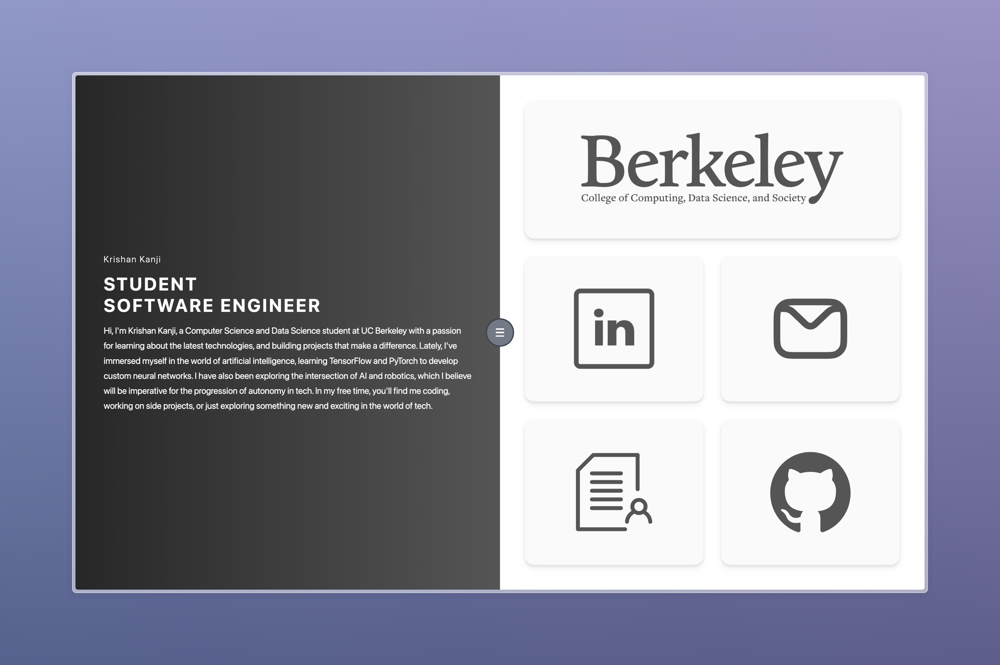
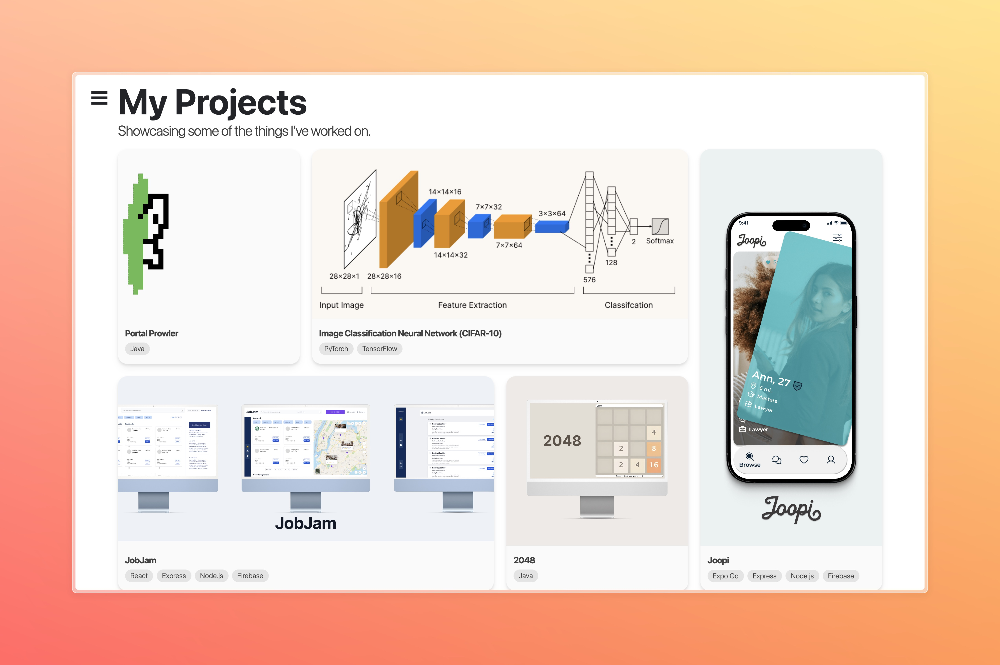
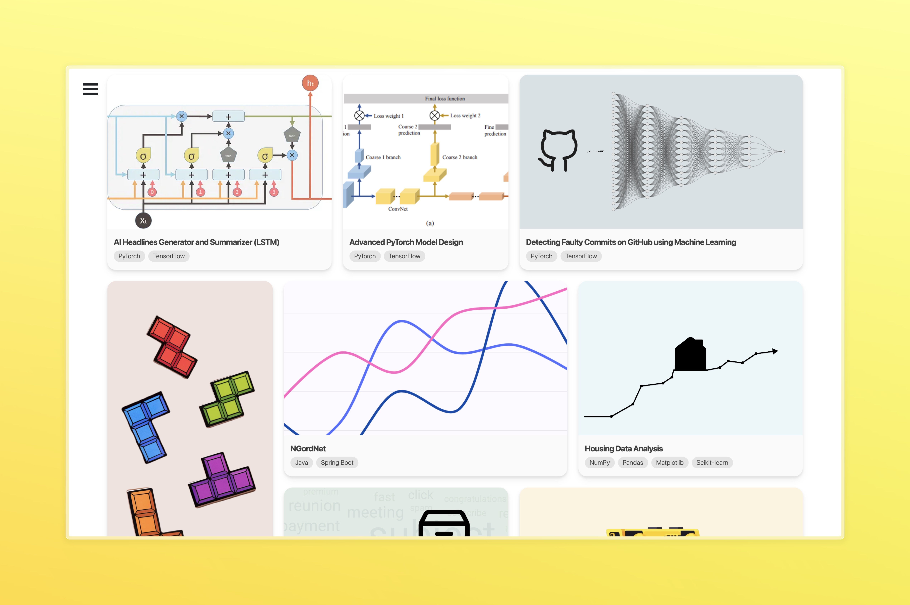
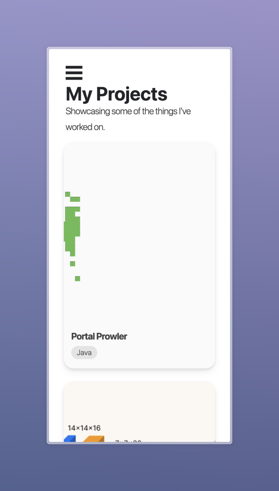
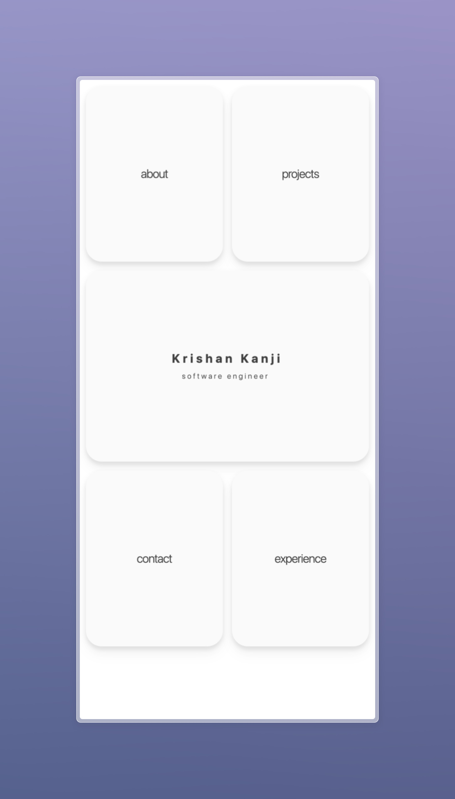
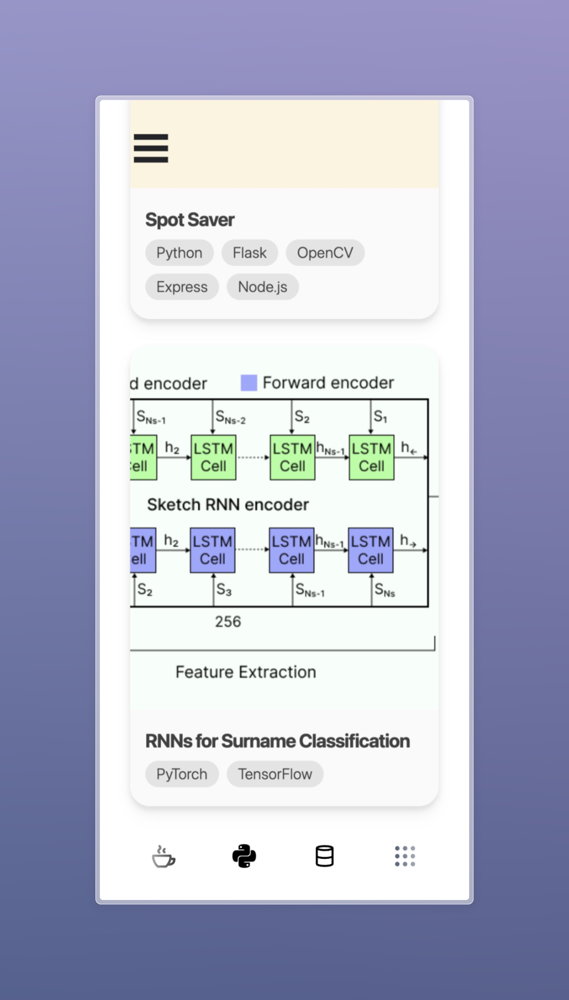

# 🌟 My Portfolio Website <a href="https://krishankanji.com/" target="_blank">(visit)</a>
Welcome to my personal site! Built with **React** and **Vite**, this website is designed to showcase my projects, experience, and more. 🚀  

---

## 🚀 Installation  
Follow these steps to get started:  

```bash
# Install dependencies
npm install

# Start the development server
npm run dev
```
## 📂 Check package.json for additional scripts and build options.
Here's how the project is organized:
```bash
index.html        # Base HTML template
vite.config.js    # Vite config for bundling
main.jsx          # App’s entry script
components/       # Reusable React components
pages/            # Portfolio sections and routing
public/           # Static assets
```
## 📸 Screenshots
### Desktop Screenshots
 
 
 
 

---

### Mobile Screenshots
Below are screenshots of the mobile version:

<p align="center">
  
  
  
</p>

## 🛠️ Built With
- React
- Vite
- Tailwind CSS 

## ✨ Contact
📧 Feel free to reach out!
- Email: krishankanji [AT] berkeley.edu
- [LinkedIn](https://linkedin.com/in/krishankanji)

## 🌟 Thank You!
### <a href="https://krishankanji.com/" target="_blank">Visit my site here!</a>
